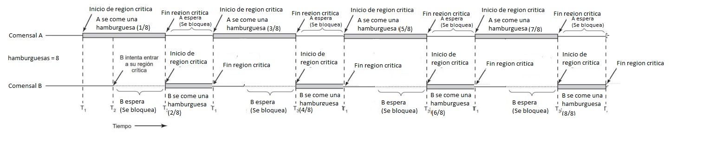

Trabajo práctico N°3
1) Ejecutar varias veces los códigos escritos en Python: sinhilos.py y
conhilos.py
a) ¿Qué se puede notar con respecto al tiempo de ejecución? ¿Es
predecible?
Lo que puede notar sobre estos códigos es que cada vez que se ejecuta cada código, tardan más o menos tiempo en ejecutarse. Esto es predecible porque se sabe que el tiempo de ejecución de cada programa nunca es el mismo.

b) Comparar con un campañero el tiempo de ejecución. ¿Son iguales?
Comparándolo con un compañero los tiempos no son iguales, pero no estan tan alejados.

c) Ejecutar el archivo suma_rasta.py unas 10 veces, luego descomentar
(borrar el #) las líneas 11,12,19 y 20 guardarlo y ejecutarlo otras 10
veces. ¿Qué pasó? ¿Por qué?
Al ejecutar el programa con comentarios, el tiempo de ejecución es más rápido que cuando las líneas 11, 12, 19 y 20 no están comentadas. Esto sucede porque toma más tiempo usar for.

2.A
<a href="./TP3/RaceCondition/con_race_condition.c">PUNTO2A</a>

2.B

